# 系统架构图和产品逻辑图

## 1. 系统架构图 (System Architecture Diagram)

### 1.1 整体系统架构

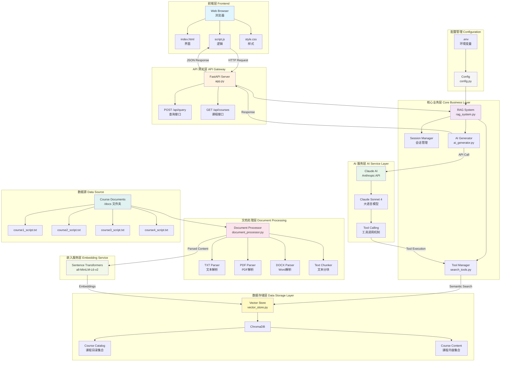

### 1.2 三层架构视图

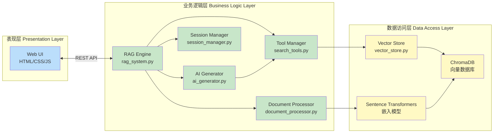

---

## 2. 产品逻辑图 (Product Logic Diagram)

### 2.1 完整业务流程图

```mermaid
flowchart TD
    Start([用户访问系统]) --> LoadUI[加载 Web 界面]
    LoadUI --> LoadCourses[后台加载课程统计]
    LoadCourses --> DisplayUI[显示界面和建议问题]

    DisplayUI --> UserInput{用户输入查询}

    UserInput -->|输入问题| CreateSession[创建/获取 Session]
    CreateSession --> SendQuery[发送查询到后端]

    SendQuery --> CheckSession{检查会话历史}
    CheckSession -->|有历史| LoadHistory[加载对话上下文]
    CheckSession -->|无历史| NewSession[创建新会话]

    LoadHistory --> SendToClaude[发送到 Claude AI]
    NewSession --> SendToClaude

    SendToClaude --> ClaudeAnalyze{Claude 分析查询}

    ClaudeAnalyze -->|需要搜索| UseTool[调用搜索工具]
    ClaudeAnalyze -->|无需搜索| DirectAnswer[直接生成答案]

    UseTool --> ParseParams[解析工具参数]
    ParseParams --> CourseMatch{课程名匹配?}

    CourseMatch -->|指定课程| FilterByCourse[按课程过滤]
    CourseMatch -->|未指定| SearchAll[搜索所有课程]

    FilterByCourse --> LessonFilter{Lesson 过滤?}
    SearchAll --> LessonFilter

    LessonFilter -->|指定 Lesson| FilterByLesson[按 Lesson 过滤]
    LessonFilter -->|未指定| VectorSearch[语义向量搜索]

    FilterByLesson --> VectorSearch
    VectorSearch --> GetResults[获取相关内容]

    GetResults --> FormatResults[格式化结果<br/>+ 来源信息]
    FormatResults --> ReturnToClaude[返回给 Claude]

    ReturnToClaude --> GenerateAnswer[生成最终答案]
    DirectAnswer --> GenerateAnswer

    GenerateAnswer --> SaveHistory[保存到会话历史]
    SaveHistory --> ReturnResponse[返回答案 + 来源]

    ReturnResponse --> DisplayAnswer[前端展示答案]
    DisplayAnswer --> ShowSources[展示来源引用]

    ShowSources --> NextQuery{继续提问?}
    NextQuery -->|是| UserInput
    NextQuery -->|否| End([结束])

    style Start fill:#4caf50,color:#fff
    style End fill:#f44336,color:#fff
    style ClaudeAnalyze fill:#2196f3,color:#fff
    style UseTool fill:#ff9800,color:#fff
    style VectorSearch fill:#9c27b0,color:#fff
    style GenerateAnswer fill:#00bcd4,color:#fff
    style DisplayAnswer fill:#8bc34a,color:#fff
```

### 2.2 文档摄取流程

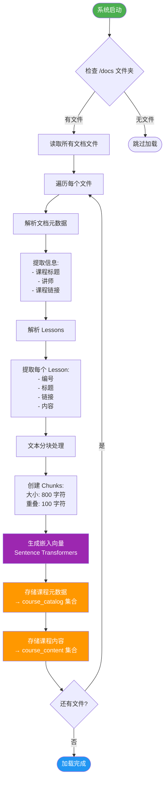

### 2.3 查询处理详细流程

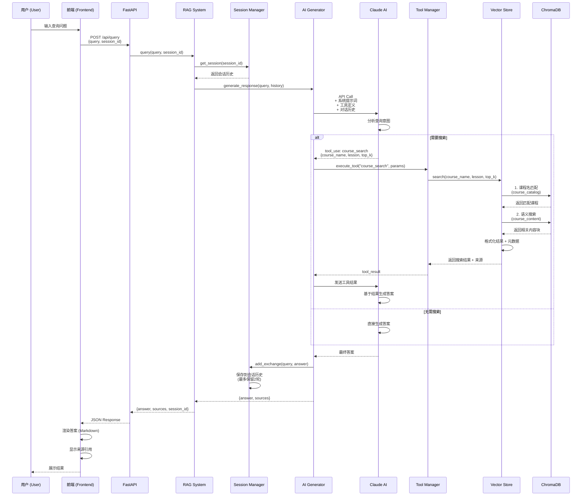

### 2.4 工具调用机制

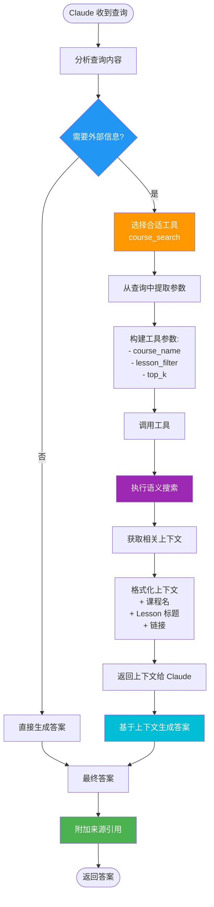

### 2.5 用户交互流程

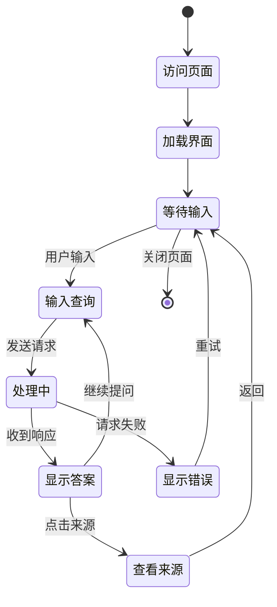

---

## 3. 数据流图 (Data Flow Diagram)

### 3.1 查询数据流

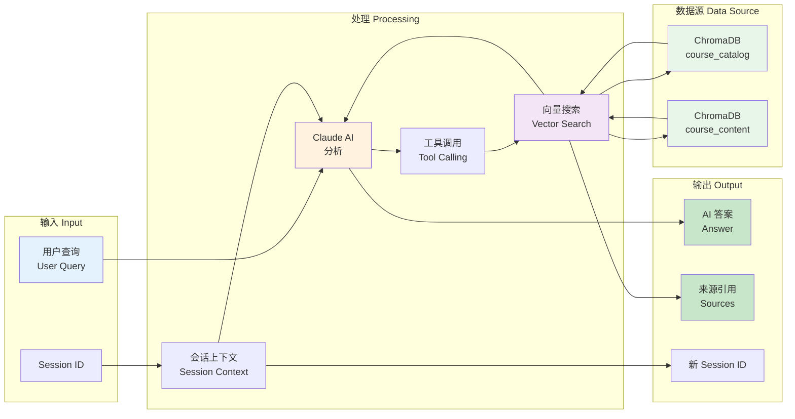

### 3.2 文档到向量的数据流

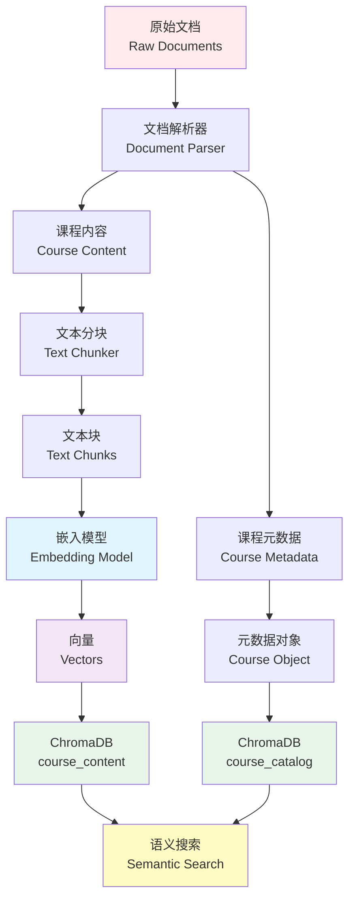

---

## 4. 组件依赖图 (Component Dependency Diagram)

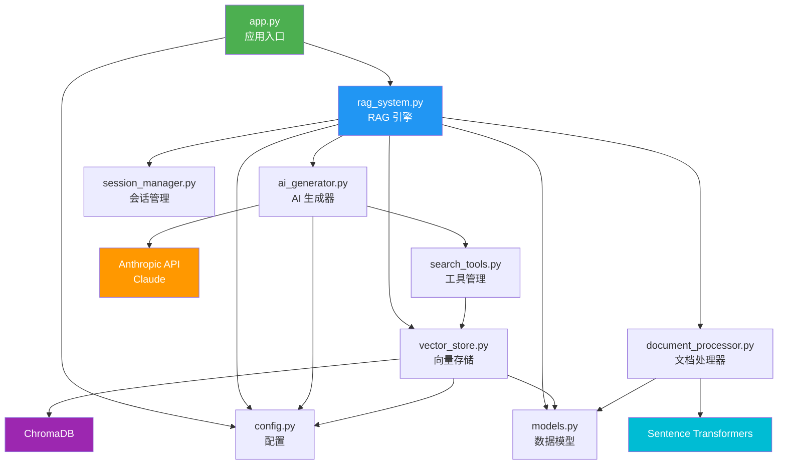

---

## 5. 部署架构图 (Deployment Architecture)

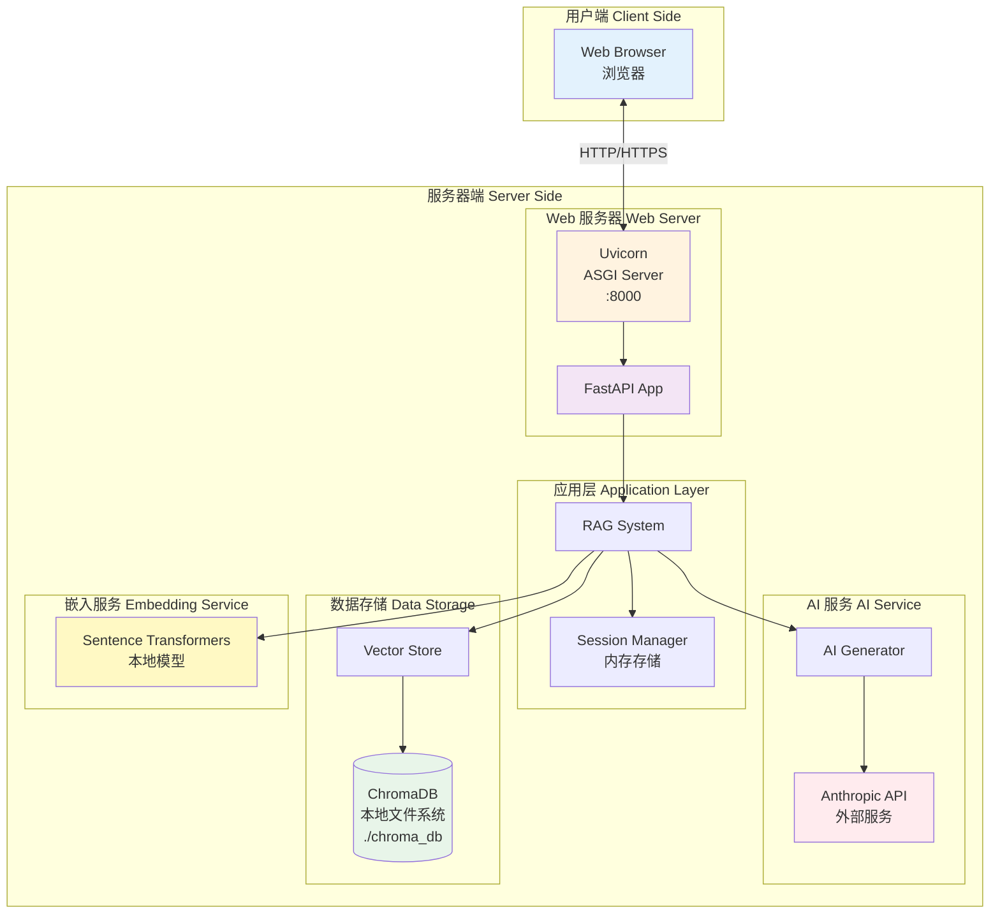

---

## 图表说明

### 系统架构图说明
1. **整体系统架构**: 展示了从前端到后端的完整技术栈和各层之间的交互关系
2. **三层架构视图**: 清晰展示表现层、业务逻辑层、数据访问层的分层设计
3. **组件依赖图**: 展示各个 Python 模块之间的依赖关系

### 产品逻辑图说明
1. **完整业务流程图**: 用户从访问到获得答案的完整流程
2. **文档摄取流程**: 系统启动时如何加载和处理课程文档
3. **查询处理详细流程**: 详细的序列图展示各组件交互时序
4. **工具调用机制**: Claude AI 如何决策和执行工具调用
5. **用户交互流程**: 状态机展示用户操作的各种状态转换

### 数据流图说明
1. **查询数据流**: 展示数据在查询过程中的流转路径
2. **文档到向量的数据流**: 展示文档如何转化为可搜索的向量

### 部署架构说明
- 展示系统在运行时的部署结构
- 包含网络层、应用层、存储层的完整视图
- 标注了端口号、存储路径等关键配置

---

## 如何查看这些图表

这些图表使用 **Mermaid** 语法编写,可以在以下平台查看:

1. **GitHub** - 直接在 GitHub 上查看此 Markdown 文件
2. **VS Code** - 安装 "Markdown Preview Mermaid Support" 插件
3. **在线编辑器** - https://mermaid.live/
4. **Notion, Obsidian** 等支持 Mermaid 的笔记工具

---

**文档版本**: 1.0
**创建日期**: 2025-10-24
**适用系统**: 课程材料 RAG 聊天机器人
